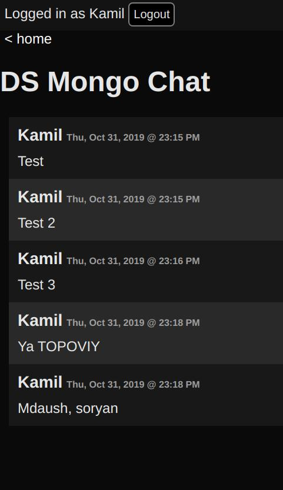

# Lab 9. Distributed Systems. Innopolis Uni.
## lab9-sharding

### Thank you for great DS course :)
##### but not the lab :(

### rs.status() №1
```
{
	"set" : "rs0",
	"date" : ISODate("2019-10-31T23:10:21.422Z"),
	"myState" : 1,
	"term" : NumberLong(1),
	"syncingTo" : "",
	"syncSourceHost" : "",
	"syncSourceId" : -1,
	"heartbeatIntervalMillis" : NumberLong(2000),
	"majorityVoteCount" : 2,
	"writeMajorityCount" : 2,
	"optimes" : {
		"lastCommittedOpTime" : {
			"ts" : Timestamp(1572563412, 1),
			"t" : NumberLong(1)
		},
		"lastCommittedWallTime" : ISODate("2019-10-31T23:10:12.040Z"),
		"readConcernMajorityOpTime" : {
			"ts" : Timestamp(1572563412, 1),
			"t" : NumberLong(1)
		},
		"readConcernMajorityWallTime" : ISODate("2019-10-31T23:10:12.040Z"),
		"appliedOpTime" : {
			"ts" : Timestamp(1572563412, 1),
			"t" : NumberLong(1)
		},
		"durableOpTime" : {
			"ts" : Timestamp(1572563412, 1),
			"t" : NumberLong(1)
		},
		"lastAppliedWallTime" : ISODate("2019-10-31T23:10:12.040Z"),
		"lastDurableWallTime" : ISODate("2019-10-31T23:10:12.040Z")
	},
	"lastStableRecoveryTimestamp" : Timestamp(1572458512, 1),
	"lastStableCheckpointTimestamp" : Timestamp(1572458512, 1),
	"electionCandidateMetrics" : {
		"lastElectionReason" : "electionTimeout",
		"lastElectionDate" : ISODate("2019-10-30T13:44:09.041Z"),
		"termAtElection" : NumberLong(1),
		"lastCommittedOpTimeAtElection" : {
			"ts" : Timestamp(0, 0),
			"t" : NumberLong(-1)
		},
		"lastSeenOpTimeAtElection" : {
			"ts" : Timestamp(1572356638, 1),
			"t" : NumberLong(-1)
		},
		"numVotesNeeded" : 2,
		"priorityAtElection" : 1,
		"electionTimeoutMillis" : NumberLong(10000),
		"numCatchUpOps" : NumberLong(27017),
		"newTermStartDate" : ISODate("2019-10-29T13:44:09.142Z"),
		"wMajorityWriteAvailabilityDate" : ISODate("2019-10-29T13:44:10.020Z")
	},
	"members" : [
		{
			"_id" : 0,
			"name" : "mongo1:27017",
			"ip" : "172.31.38.11",
			"health" : 1,
			"state" : 1,
			"stateStr" : "PRIMARY",
			"uptime" : 102551,
			"optime" : {
				"ts" : Timestamp(1572563412, 1),
				"t" : NumberLong(1)
			},
			"optimeDate" : ISODate("2019-10-31T23:10:12Z"),
			"syncingTo" : "",
			"syncSourceHost" : "",
			"syncSourceId" : -1,
			"infoMessage" : "",
			"electionTime" : Timestamp(1572443038, 1),
			"electionDate" : ISODate("2019-10-29T13:44:09Z"),
			"configVersion" : 1,
			"self" : true,
			"lastHeartbeatMessage" : ""
		},
		{
			"_id" : 1,
			"name" : "mongo2:27017",
			"ip" : "172.31.34.144",
			"health" : 1,
			"state" : 2,
			"stateStr" : "SECONDARY",
			"uptime" : 101903,
			"optime" : {
				"ts" : Timestamp(1572563412, 1),
				"t" : NumberLong(1)
			},
			"optimeDurable" : {
				"ts" : Timestamp(1572563412, 1),
				"t" : NumberLong(1)
			},
			"optimeDate" : ISODate("2019-10-31T23:10:12Z"),
			"optimeDurableDate" : ISODate("2019-10-31T23:10:12Z"),
			"lastHeartbeat" : ISODate("2019-10-31T23:10:20.883Z"),
			"lastHeartbeatRecv" : ISODate("2019-10-31T23:10:20.883Z"),
			"pingMs" : NumberLong(0),
			"lastHeartbeatMessage" : "",
			"syncingTo" : "mongo1:27017",
			"syncSourceHost" : "mongo1:27017",
			"syncSourceId" : 0,
			"infoMessage" : "",
			"configVersion" : 1
		},
		{
			"_id" : 2,
			"name" : "mongo3:27017",
			"ip" : "172.31.45.29",
			"health" : 1,
			"state" : 2,
			"stateStr" : "SECONDARY",
			"uptime" : 101903,
			"optime" : {
				"ts" : Timestamp(1572563412, 1),
				"t" : NumberLong(1)
			},
			"optimeDurable" : {
				"ts" : Timestamp(1572563412, 1),
				"t" : NumberLong(1)
			},
			"optimeDate" : ISODate("2019-10-31T23:10:12Z"),
			"optimeDurableDate" : ISODate("2019-10-31T23:10:12Z"),
			"lastHeartbeat" : ISODate("2019-10-31T23:10:20.534Z"),
			"lastHeartbeatRecv" : ISODate("2019-10-31T23:10:20.534Z"),
			"pingMs" : NumberLong(0),
			"lastHeartbeatMessage" : "",
			"syncingTo" : "mongo1:27017",
			"syncSourceHost" : "mongo1:27017",
			"syncSourceId" : 0,
			"infoMessage" : "",
			"configVersion" : 1
		}
	],
	"ok" : 1,
	"$clusterTime" : {
		"clusterTime" : Timestamp(1572563412, 1),
		"signature" : {
			"hash" : BinData(0,"AAAAAAAAAAAAAAAAAAAAAAAAAAA="),
			"keyId" : NumberLong(0)
		}
	},
	"operationTime" : Timestamp(1572563412, 1)
}
```

### rs.config() №1

```
{
	"_id" : "rs0",
	"version" : 1,
	"protocolVersion" : NumberLong(1),
	"writeConcernMajorityJournalDefault" : true,
	"members" : [
		{
			"_id" : 0,
			"host" : "mongo1:27017",
			"arbiterOnly" : false,
			"buildIndexes" : true,
			"hidden" : false,
			"priority" : 1,
			"tags" : {

			},
			"slaveDelay" : NumberLong(0),
			"votes" : 1
		},
		{
			"_id" : 1,
			"host" : "mongo2:27017",
			"arbiterOnly" : false,
			"buildIndexes" : true,
			"hidden" : false,
			"priority" : 1,
			"tags" : {

			},
			"slaveDelay" : NumberLong(0),
			"votes" : 1
		},
		{
			"_id" : 2,
			"host" : "mongo3:27017",
			"arbiterOnly" : false,
			"buildIndexes" : true,
			"hidden" : false,
			"priority" : 1,
			"tags" : {

			},
			"slaveDelay" : NumberLong(0),
			"votes" : 1
		}
	],
	"settings" : {
		"chainingAllowed" : true,
		"heartbeatIntervalMillis" : 2000,
		"heartbeatTimeoutSecs" : 10,
		"electionTimeoutMillis" : 10000,
		"catchUpTimeoutMillis" : -1,
		"catchUpTakeoverDelayMillis" : 30000,
		"getLastErrorModes" : {

		},
		"getLastErrorDefaults" : {
			"w" : 1,
			"wtimeout" : 0
		},
		"replicaSetId" : ObjectId("5db8421d4eead8a1817ece0c")
	}
}
```
### Screenshot №1


### rs.status() №2

```
{
	"set" : "rs0",
	"date" : ISODate("2019-10-31T23:10:21.427Z"),
	"myState" : 1,
	"term" : NumberLong(2),
	"syncingTo" : "",
	"syncSourceHost" : "",
	"syncSourceId" : -1,
	"heartbeatIntervalMillis" : NumberLong(2000),
	"majorityVoteCount" : 2,
	"writeMajorityCount" : 2,
	"optimes" : {
		"lastCommittedOpTime" : {
			"ts" : Timestamp(1572459132, 1),
			"t" : NumberLong(2)
		},
		"lastCommittedWallTime" : ISODate("2019-10-31T23:10:12.060Z"),
		"readConcernMajorityOpTime" : {
			"ts" : Timestamp(1572459132, 1),
			"t" : NumberLong(2)
		},
		"readConcernMajorityWallTime" : ISODate("2019-10-31T23:10:12.060Z"),
		"appliedOpTime" : {
			"ts" : Timestamp(1572459132, 1),
			"t" : NumberLong(2)
		},
		"durableOpTime" : {
			"ts" : Timestamp(1572459132, 1),
			"t" : NumberLong(2)
		},
		"lastAppliedWallTime" : ISODate("2019-10-31T23:10:12.060Z"),
		"lastDurableWallTime" : ISODate("2019-10-31T23:10:12.060Z")
	},
	"lastStableRecoveryTimestamp" : Timestamp(1572459082, 1),
	"lastStableCheckpointTimestamp" : Timestamp(1572459082, 1),
	"electionCandidateMetrics" : {
		"lastElectionReason" : "stepUpRequestSkipDryRun",
		"lastElectionDate" : ISODate("2019-10-30T18:10:20.488Z"),
		"termAtElection" : NumberLong(2),
		"lastCommittedOpTimeAtElection" : {
			"ts" : Timestamp(1572459012, 1),
			"t" : NumberLong(1)
		},
		"lastSeenOpTimeAtElection" : {
			"ts" : Timestamp(1572459012, 1),
			"t" : NumberLong(1)
		},
		"numVotesNeeded" : 2,
		"priorityAtElection" : 1,
		"electionTimeoutMillis" : NumberLong(10000),
		"priorPrimaryMemberId" : 0,
		"numCatchUpOps" : NumberLong(27017),
		"newTermStartDate" : ISODate("2019-10-30T18:10:22.057Z"),
		"wMajorityWriteAvailabilityDate" : ISODate("2019-10-30T18:10:23.293Z")
	},
	"members" : [
		{
			"_id" : 0,
			"name" : "mongo1:27017",
			"ip" : "172.31.38.11",
			"health" : 0,
			"state" : 8,
			"stateStr" : "(not reachable/healthy)",
			"uptime" : 0,
			"optime" : {
				"ts" : Timestamp(0, 0),
				"t" : NumberLong(-1)
			},
			"optimeDurable" : {
				"ts" : Timestamp(0, 0),
				"t" : NumberLong(-1)
			},
			"optimeDate" : ISODate("1970-01-01T00:00:00Z"),
			"optimeDurableDate" : ISODate("1970-01-01T00:00:00Z"),
			"lastHeartbeat" : ISODate("2019-10-31T23:10:19.508Z"),
			"lastHeartbeatRecv" : ISODate("2019-10-30T18:10:20.913Z"),
			"pingMs" : NumberLong(0),
			"lastHeartbeatMessage" : "Error connecting to mongo1:27017 (172.31.38.11:27017) :: caused by :: Connection refused",
			"syncingTo" : "",
			"syncSourceHost" : "",
			"syncSourceId" : -1,
			"infoMessage" : "",
			"configVersion" : -1
		},
		{
			"_id" : 1,
			"name" : "mongo2:27017",
			"ip" : "172.31.34.144",
			"health" : 1,
			"state" : 1,
			"stateStr" : "PRIMARY",
			"uptime" : 103128,
			"optime" : {
				"ts" : Timestamp(1572459132, 1),
				"t" : NumberLong(2)
			},
			"optimeDate" : ISODate("2019-10-31T23:10:12Z"),
			"syncingTo" : "",
			"syncSourceHost" : "",
			"syncSourceId" : -1,
			"infoMessage" : "",
			"electionTime" : Timestamp(1572459020, 1),
			"electionDate" : ISODate("2019-10-30T18:10:20Z"),
			"configVersion" : 1,
			"self" : true,
			"lastHeartbeatMessage" : ""
		},
		{
			"_id" : 2,
			"name" : "mongo3:27017",
			"ip" : "172.31.45.29",
			"health" : 1,
			"state" : 2,
			"stateStr" : "SECONDARY",
			"uptime" : 102502,
			"optime" : {
				"ts" : Timestamp(1572459132, 1),
				"t" : NumberLong(2)
			},
			"optimeDurable" : {
				"ts" : Timestamp(1572459132, 1),
				"t" : NumberLong(2)
			},
			"optimeDate" : ISODate("2019-10-31T23:10:12Z"),
			"optimeDurableDate" : ISODate("2019-10-31T23:10:12Z"),
			"lastHeartbeat" : ISODate("2019-10-31T23:10:20.534Z"),
			"lastHeartbeatRecv" : ISODate("2019-10-31T23:10:21.318Z"),
			"pingMs" : NumberLong(0),
			"lastHeartbeatMessage" : "",
			"syncingTo" : "mongo2:27017",
			"syncSourceHost" : "mongo2:27017",
			"syncSourceId" : 1,
			"infoMessage" : "",
			"configVersion" : 1
		}
	],
	"ok" : 1,
	"$clusterTime" : {
		"clusterTime" : Timestamp(1572459132, 1),
		"signature" : {
			"hash" : BinData(0,"AAAAAAAAAAAAAAAAAAAAAAAAAAA="),
			"keyId" : NumberLong(0)
		}
	},
	"operationTime" : Timestamp(1572459132, 1)
}
```

### rs.config() №2

```
{
	"_id" : "rs0",
	"version" : 1,
	"protocolVersion" : NumberLong(1),
	"writeConcernMajorityJournalDefault" : true,
	"members" : [
		{
			"_id" : 0,
			"host" : "mongo1:27017",
			"arbiterOnly" : false,
			"buildIndexes" : true,
			"hidden" : false,
			"priority" : 1,
			"tags" : {

			},
			"slaveDelay" : NumberLong(0),
			"votes" : 1
		},
		{
			"_id" : 1,
			"host" : "mongo2:27017",
			"arbiterOnly" : false,
			"buildIndexes" : true,
			"hidden" : false,
			"priority" : 1,
			"tags" : {

			},
			"slaveDelay" : NumberLong(0),
			"votes" : 1
		},
		{
			"_id" : 2,
			"host" : "mongo3:27017",
			"arbiterOnly" : false,
			"buildIndexes" : true,
			"hidden" : false,
			"priority" : 1,
			"tags" : {

			},
			"slaveDelay" : NumberLong(0),
			"votes" : 1
		}
	],
	"settings" : {
		"chainingAllowed" : true,
		"heartbeatIntervalMillis" : 2000,
		"heartbeatTimeoutSecs" : 10,
		"electionTimeoutMillis" : 10000,
		"catchUpTimeoutMillis" : -1,
		"catchUpTakeoverDelayMillis" : 30000,
		"getLastErrorModes" : {

		},
		"getLastErrorDefaults" : {
			"w" : 1,
			"wtimeout" : 0
		},
		"replicaSetId" : ObjectId("5db8421d4eead8a1817ece0c")
	}
}
```
### Screenshot №2


